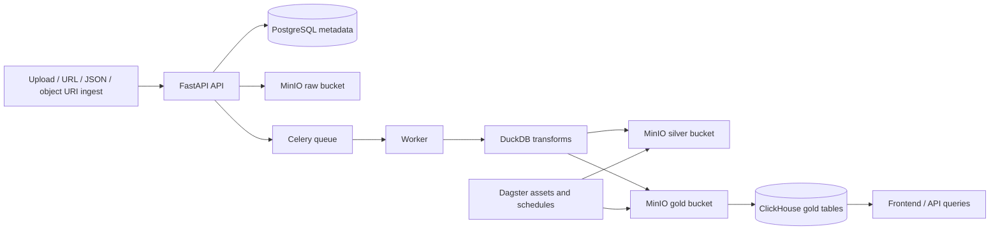

# Medallion Backend Platform

This repository boots a containerized backend for large-scale ingest, medallion processing, and frontend-serving analytics.

The platform uses:

- FastAPI for the control plane and frontend-facing API
- PostgreSQL for operational metadata
- MinIO for raw, silver, and gold object storage
- Celery + Redis for asynchronous ingestion and processing
- DuckDB for file-oriented ELT and ETL transforms
- ClickHouse for low-latency gold serving
- Dagster for extensible workflow orchestration

## Architecture



## What is implemented

The repository includes:

- dataset registry and metadata model
- schema snapshots for raw, silver, and gold with deduplicated versioning plus a first-class schema approval workflow
- ingestion jobs with direct upload, pre-signed upload, inline JSON, URL ingest, existing object-URI ingest, and raw reprocessing
- object-URI ingestion accepts `s3://`, `s3a://`, and `s3n://` URIs and decodes percent-escaped keys for better interoperability
- ClickHouse loading now safely re-encodes object keys when building S3 HTTP URLs, so spaces and reserved characters in landed object names do not break gold loading
- stronger idempotency with a database uniqueness constraint on dataset plus idempotency key
- quality-rule model, persisted quality results, and quality-rule CRUD endpoints
- quality trend history endpoints with bucketed pass/fail summaries and per-rule trend rollups over persisted quality results
- observability summary and activity endpoints that roll up datasets, pipelines, ingestions, quality outcomes, and worker/control-plane events over recent windows
- dataset export and import endpoints for promoting configuration across environments
- metadata backup and restore endpoints that round-trip all dataset configurations in one bundle
- artifact manifest retrieval endpoints for ingestion jobs and pipeline runs, exposing landed object URIs with schema snapshot and execution context
- data-product registry with support for custom frontend-facing table names plus immutable version history on create/update
- data-product version history with current-version tracking plus read and update endpoints for versioned frontend-facing product definitions
- searchable dataset and pipeline catalog endpoints, including free-text matching across slug, name, description, tags, and gold table name for datasets plus latest ingestion timestamp and latest-run summary fields for pipeline discovery
- pipeline-definition registry with create, list, get, update, execution-plan inspection, source-candidate listing enriched with latest-run context, persisted run-preflight endpoints, persisted rejected strict-preflight attempts with compatibility outcomes, batch backfill preflight creation through offset or checkpoint-paged selection, SQL pipeline-run lifecycle claim/transition endpoints for executor handoff, first-class run artifact-manifest retrieval, and a built-in SQL executor task that claims the next planned run and materializes its output artifact
- composite indexing for general pipeline-run history scans, pipeline run source lookups, pipeline run `run_ref` history filters, and pipeline preflight-attempt audit filters to keep replay, dedup, and historical discovery efficient as volume grows
- pipeline definition names are trimmed at request validation time and blank names are rejected before they reach the service layer
- automatic raw -> silver -> gold execution in a worker via a dedicated processing service
- Celery worker retries now preserve the in-flight job status until retries are exhausted and record retry metadata in `job_metadata.processing.retry` for easier debugging of transient failures
- API request correlation IDs via `X-Request-ID` response headers and log context, so request-scoped traces can be followed across HTTP logs without guessing
- opt-in per-client API rate limiting with `429` responses, `Retry-After`, and `X-RateLimit-*` headers using API keys when present and client IP fallback otherwise
- configurable webhook notifications for terminal ingestion-job and pipeline-run outcomes, with event filtering and best-effort JSON delivery to one or more external URLs
- first-class control-plane audit trail and operational worker/CLI event history with persisted per-request HTTP events plus worker and CLI maintenance events, principal and request correlation metadata, and filtered list/count/page retrieval endpoints
- lazy metadata DB settings, migration loading, and engine/session initialization so tests, scripts, and partial-dependency tooling can import the codebase without eagerly requiring the settings stack or a live Postgres driver
- exact direct-dependency lock files for runtime and development installs, plus a built-in verifier that keeps those pins aligned with `pyproject.toml`
- file-backed secrets management via `<NAME>_FILE` and `SECRETS_DIR`, plus a built-in verifier that catches ambiguous sources, unreadable secret files, and production-style default-secret fallbacks
- configurable metadata retention and cleanup policies for pipeline runs, preflight attempts, quality results, and ingestion-job history via a built-in dry-run/apply CLI
- lazy ClickHouse dependency loading so importing ClickHouseService no longer requires clickhouse-connect or settings dependencies until first real use
- lazy object-storage dependency loading so importing ObjectStorageService no longer requires boto3, botocore, or settings dependencies until first real use
- lazy object storage dependency loading so importing ObjectStorageService no longer requires the settings stack or boto3/botocore until first real use, while still supporting explicit client injection for tests and scripts
- lazy DuckDB dependency loading so importing DuckDBService no longer requires duckdb, pandas, or the settings stack until first real use, while still supporting explicit module injection for tests and scripts
- lazy FastAPI app bootstrap so importing `data_platform.api.main` no longer requires FastAPI, route modules, settings, or logging configuration until the app is actually built
- lazy Celery worker bootstrap so importing `data_platform.workers.celery_app` no longer requires Celery, settings, or logging configuration until the app is actually built, and importing the task module no longer eagerly requires SQLAlchemy models or processing services
- lazy Celery worker bootstrap so importing `data_platform.workers.celery_app` no longer requires Celery, settings, or logging configuration until the worker app is actually built
- lazy security helper imports so importing `data_platform.security` for API-key hashing no longer requires SQLAlchemy models or settings until a database-backed authentication or seeding helper is actually called
- automatic ClickHouse table creation, column adds, and column type widening
- ClickHouse `serving_config.partition_by` and both string/list `serving_config.order_by` values are validated through a safe identifier-and-function grammar before generated DDL is emitted; dataset create/update requests now reject invalid serving config at schema-validation time, and empty values or non-string order-by list items are rejected explicitly rather than being coerced or silently falling back to defaults
- decimal and numeric schema evolution now canonicalize fixed-point definitions, preserve existing scale when integer data arrives later, and use the highest observed scale when decimal inputs widen
- idempotent ClickHouse loading by deleting prior rows for the same ingestion id before insert
- safer read-only SQL validation for dataset transforms and quality rules
- richer operational APIs for dataset stats, ingestion listings, schema snapshots, schema approvals, schema diffs, schema compatibility previews, quality results, artifact manifest retrieval, and worker console history/tails for ingestion jobs and pipeline runs
- dataset-filtered ingestion history scans now use a dedicated `(dataset_id, created_at)` lookup index, and `GET /v1/ingestions` preserves deterministic newest-first ordering with `created_at` and id tie-breakers
- source-candidate discovery now includes latest matching run completion and error context for easier replay and backfill decisions
- versioned metadata schema migrations with legacy bootstrap stamping for existing unversioned deployments
- safer filename sanitization that strips path segments and bounds staged filenames to filesystem-friendly lengths
- deep readiness checks for PostgreSQL, Redis, object storage, and ClickHouse
- approximate total-row previews by default for massive gold tables, with optional exact totals
- Dagster deployment with a sample silver -> gold asset

## Supported source formats

Built-in parsing supports:

- CSV and CSV.GZ
- TSV and TSV.GZ
- JSON and JSON.GZ
- NDJSON / JSONL and gzipped variants
- Parquet
- XLSX / XLSM

Format detection uses explicit format aliases, normalized content type, filename extension, and content sniffing. This makes extensionless uploads, `jsonl` and `.jsonl.gz` aliases, `csv.gz` explicit hints, UTF-8 BOM JSON, UTF-16 text files, large extensionless XLSX/XLSM archives, and content types like `text/csv; charset=utf-8` or `application/jsonl; charset=utf-8` work reliably. Truncated or corrupt gzip-looking uploads now fail cleanly as unsupported formats and can no longer masquerade as CSV or JSON during fallback sniffing or claimed text-format paths, generic ZIP archives that are not Excel no longer fall through to text heuristics or claimed text-format hints, extensionless payloads with obvious binary signatures or NUL bytes no longer fall through to CSV/TSV heuristics, obvious HTML or XML error pages are rejected even when an extensionless payload, misleading `.csv` filename, `text/csv` content type, or explicit text-format hint would otherwise suggest tabular data, obvious binary payloads such as PDF and image files can no longer pass through claimed text-format paths just because the filename or content type looks tabular, plain text that does not look like structured JSON can no longer masquerade as claimed `json` or `ndjson`, and binary claims such as `.parquet`, Excel MIME types, or explicit binary-format hints are cross-checked against the actual payload when a local file is available.

Uploaded and inferred filenames are sanitized defensively. Dot-only basenames such as `.`, `..`, and `...` fall back to `payload.bin` so temporary processing paths stay inside their intended working directory.

Internally generated `s3://` object URIs percent-encode reserved key characters such as spaces and `#`, while object-URI ingest accepts percent-escaped keys and decodes them back to the storage key.
Bucket names are normalized defensively in internal URI helpers, and object keys with empty values or any `.` / `..` path segment are rejected early so malformed storage URIs do not propagate into ClickHouse loading or ingestion metadata.

## Metadata schema migrations

The metadata database now initializes through a versioned migration runner instead of calling `Base.metadata.create_all()` directly at startup.

- Fresh databases apply the baseline migration and record it in `schema_migrations`.
- Existing legacy deployments that already have the full bootstrap schema but no migration history are stamped to version `1` automatically.
- Partially initialized, unversioned databases fail fast instead of being silently modified.
- Follow-on migrations that add new tables with foreign keys are also applied cleanly on fresh SQLite and PostgreSQL databases, so a full migration replay now succeeds in local tests instead of stalling on standalone table-add steps.

This creates a safe foundation for future metadata upgrades without breaking existing bootstrapped environments.

## Baseline health check

You can run a built-in baseline verification summary before making changes:

```bash
make healthcheck
```

The command exits non-zero when any selected check fails, while skipped checks still keep the summary successful. Invalid `--path` values are reported as failed checks instead of crashing with a traceback.

For a concise status grid that shows exactly which verification checks were run and whether each passed, failed, or was skipped, use:

```bash
make verify-matrix
```

Like `make healthcheck`, the matrix command exits non-zero when any selected check fails, and invalid `--path` values are reported cleanly inside the matrix output.

You can also request a subset of checks or JSON output directly:

```bash
python -m data_platform.verification_matrix --checks build,test --json
```

Or run the module directly for machine-readable output:

```bash
python -m data_platform.baseline_health --checks build,test --json
```

The report includes six check slots:

- secrets (`python -m data_platform.secrets`)
- deps (`python -m data_platform.dependency_locks`)
- build (`python -m compileall src tests`)
- test (`pytest -q`)
- lint (`ruff check src tests`) when Ruff is available
- typecheck (`mypy src`) when mypy is available

Checks whose tools are not installed are reported as `skipped` instead of failing the whole summary. Unknown `--checks` names are rejected with a concise CLI error and exit code `2` instead of a Python traceback.

## Dependency lock strategy

The repository now carries two exact direct-dependency lock files:

- `requirements-runtime.lock` for runtime dependencies
- `requirements-dev.lock` for development-only dependencies, with a single `-r requirements-runtime.lock` include

`pyproject.toml` remains the source of truth for published dependency metadata and compatible version ranges, while the lock files pin the exact direct versions used by local and CI installs. You can verify that those lock files still match the direct dependency subjects declared in `pyproject.toml` with:

```bash
make verify-locks
```

The same check is also part of `make healthcheck`, `make verify-matrix`, and the main `make verify` target.

## Secrets management

The repository now supports file-backed secrets for the main sensitive settings. You can provide direct environment variables as before, point one setting at an explicit file with `<NAME>_FILE`, or set `SECRETS_DIR` so the platform looks for files named after the managed secret variables. The managed set currently covers:

- `POSTGRES_PASSWORD`
- `S3_ACCESS_KEY`
- `S3_SECRET_KEY`
- `CLICKHOUSE_PASSWORD`
- `SEED_DEV_API_KEY`

Explicit environment values still take precedence over settings defaults, explicit `<NAME>_FILE` entries take precedence over `SECRETS_DIR`, and ambiguous `NAME` plus `NAME_FILE` combinations are rejected as configuration errors. Secret files are read as UTF-8 and have trailing newlines trimmed so Docker- or Kubernetes-style mounted secrets work without extra preprocessing.

You can verify secret configuration directly with:

```bash
make verify-secrets
```

The verifier exits non-zero when a configured secret file is missing, empty, unreadable, or conflicts with a direct environment value. In non-development `APP_ENV` values it also fails when the platform would still fall back to repository default secrets, which helps catch unsafe production-like deployments before startup.

## Webhook notifications

The backend can emit configurable outbound webhook notifications for terminal ingestion-job and pipeline-run outcomes. Set `ENABLE_WEBHOOK_NOTIFICATIONS=true` to enable the feature. When enabled, deliveries are sent as JSON envelopes to every configured URL and include the current app name/env, event type, timestamp, and a resource payload with the relevant identifiers, status, task id when available, and derived execution or artifact-manifest details already persisted on the job or run. Notifications are best-effort: delivery failures are logged, but they do not change the original API or worker outcome.

You can control the feature with these environment variables:

- `ENABLE_WEBHOOK_NOTIFICATIONS`
- `NOTIFICATION_WEBHOOK_URLS` as a comma-separated list
- `NOTIFICATION_EVENTS` as a comma-separated list such as `ingestion_job.failed,pipeline_run.failed` or `*`
- `NOTIFICATION_TIMEOUT_SECONDS`

By default the feature is disabled and the default event filter only covers failed ingestion jobs and failed pipeline runs. Successful ingestion and pipeline completion events are also emitted when they are included in `NOTIFICATION_EVENTS`.

## Metadata retention and cleanup

Operational metadata cleanup is available through a built-in CLI. The repository now exposes four TTL settings:

- `RETENTION_PIPELINE_RUN_DAYS`
- `RETENTION_PREFLIGHT_ATTEMPT_DAYS`
- `RETENTION_QUALITY_RESULT_DAYS`
- `RETENTION_INGESTION_JOB_DAYS`

Each value is expressed in whole days. Positive values enable cleanup for that table, and `0` disables cleanup for that specific metadata class. The CLI defaults to a dry preview so you can inspect matched row counts and cutoffs before deleting anything:

```bash
make cleanup-metadata
```

To apply the configured retention policies instead of previewing them:

```bash
make cleanup-metadata-apply
```

You can also run the module directly with `--json`, `--apply`, or an explicit `--now` timestamp for reproducible previews in automation or tests.

## Repository snapshot

You can capture the current repository state before making changes:

```bash
make snapshot
```

Or run the module directly for machine-readable output:

```bash
python -m data_platform.repo_snapshot --json --recent-limit 10
```

The snapshot reports:

- current branch
- latest commit
- dirty tracked files
- untracked files
- recent commit history

If the path is not a Git checkout, the tool reports that cleanly instead of failing. Missing paths or non-directory `--path` values are also reported cleanly in both human and JSON output, return exit code `2`, and expose a first-class `path_error_reason` field so automation can distinguish invalid input from an ordinary non-git directory. Negative `--recent-limit` values are also rejected cleanly with exit code `2` instead of being treated as an empty commit history request. Non-Git snapshots continue to expose the existing `reason` field, invalid-path snapshots still preserve the legacy `path_error` field for compatibility, and every snapshot payload now also includes first-class `clean_failure_reason`, `clean_requirement_satisfied`, and `worktree_status_reason` fields so scripts can see both why a stricter cleanliness check would fail and whether that requirement is satisfied, failed, or unavailable without reparsing file lists. When you pass `--require-clean`, the command instead returns exit code `1` unless the target is a clean Git checkout with no dirty tracked files or untracked files, so a non-git directory also fails that stricter cleanliness check while invalid paths still preserve exit code `2`. If Git metadata itself is unavailable, the snapshot keeps that underlying reason instead of collapsing it into the ordinary non-git-directory failure message. If `git status` itself cannot inspect an otherwise valid checkout, the snapshot now preserves that first-class `worktree_status_reason` instead of silently reporting empty dirty and untracked lists as if the checkout were clean. In human-readable mode, the summary now also includes a `Clean requirement` line so manual runs make it obvious why the stricter exit code was returned.
Dirty, untracked, and renamed paths are parsed from NUL-delimited Git porcelain output so filenames with spaces are reported accurately without shell-style quoting or rename arrow markup, and non-UTF-8 filenames remain inspectable through filesystem-safe decoding. Human-readable output also escapes control characters in file paths so unusual names cannot break the rendered summary layout, and it now marks dirty/untracked status as unavailable when `git status` fails for a real checkout.

## Quick start

1. Copy the environment file:

```bash
cp .env.example .env
```

2. Start the stack:

```bash
docker compose up --build
```

3. Open the main surfaces:

- API docs: `http://localhost:8000/docs`
- Dagster UI: `http://localhost:3000`
- Flower: `http://localhost:5555`
- MinIO console: `http://localhost:9001`

4. Use the seeded development API key:

```text
X-API-Key: dev-local-key
```

The seeded client is automatically upgraded on startup to include read/write scopes for datasets, ingestions, and pipelines plus gold read access.

The compose stack also exposes `http-fixture` on `:8079` with stable payloads for GDELT, ReliefWeb, OpenSanctions, NASA FIRMS, NOAA hazards, KEV, and ACLED credential-gated stubs. Maritime, aviation, and space stay on their non-HTTP fixture packs until concrete source registry entries are introduced.

For the read-only Go REST API used by the frontend contract work, keep the shared key on the server side. A BFF or other trusted server-side caller should read `API_SHARED_KEY` from the runtime environment and attach it as `X-API-Key` when calling protected `/v1/*` routes. Browser clients should not receive the shared key directly.

<!-- BEGIN GENERATED: api-route-inventory -->
## Frontend Go REST API contract

The read-only Go REST API keeps one authoritative route inventory shared by router registration, `/v1/schema`, contract fixtures, and generated docs.

Public routes: `/v1/health`, `/v1/ready`, `/v1/version`, `/v1/schema`. All other `/v1/*` routes require `X-API-Key`.

Current route inventory:
- `GET /v1/health` — public
- `GET /v1/ready` — public
- `GET /v1/version` — public
- `GET /v1/schema` — public
- `GET /v1/jobs` — protected
- `GET /v1/jobs/{jobId}` — protected
- `GET /v1/sources` — protected
- `GET /v1/sources/{sourceId}` — protected
- `GET /v1/sources/{sourceId}/coverage` — protected
- `GET /v1/places` — protected
- `GET /v1/places/{placeId}` — protected
- `GET /v1/places/{placeId}/children` — protected
- `GET /v1/places/{placeId}/metrics` — protected
- `GET /v1/places/{placeId}/events` — protected
- `GET /v1/places/{placeId}/observations` — protected
- `GET /v1/entities` — protected
- `GET /v1/entities/{entityId}` — protected
- `GET /v1/entities/{entityId}/tracks` — protected
- `GET /v1/entities/{entityId}/events` — protected
- `GET /v1/entities/{entityId}/places` — protected
- `GET /v1/events` — protected
- `GET /v1/events/{eventId}` — protected
- `GET /v1/observations` — protected
- `GET /v1/observations/{recordId}` — protected
- `GET /v1/metrics` — protected
- `GET /v1/metrics/{metricId}` — protected
- `GET /v1/analytics/rollups` — protected
- `GET /v1/analytics/time-series` — protected
- `GET /v1/analytics/hotspots` — protected
- `GET /v1/analytics/cross-domain` — protected
- `GET /v1/search` — protected
- `GET /v1/search/places` — protected
- `GET /v1/search/entities` — protected
- `GET /v1/internal/stats` — protected
- `GET /v1/internal/worker-tail` — protected
<!-- END GENERATED: api-route-inventory -->

The checked-in `docker-compose.yml` now wires `API_SHARED_KEY` directly into the API service so local stack behavior is explicit instead of relying on an implicit `.env` pass-through. Set the same value in `.env` (or start from `.env.example`) and have your BFF send that header on protected route requests.

The platform also supports file-backed secrets via `<NAME>_FILE` or a shared `SECRETS_DIR`, so local Docker, CI, and container-orchestrated deployments do not need to inline sensitive values directly in `.env` files.

Optional request throttling is available through `ENABLE_RATE_LIMIT`, `RATE_LIMIT_REQUESTS`, `RATE_LIMIT_WINDOW_SECONDS`, and `RATE_LIMIT_EXEMPT_PATHS`. When enabled, the API enforces a fixed-window per-client limit, prefers `X-API-Key` for client identity, falls back to client IP for anonymous traffic, and returns `429` with `Retry-After`, `X-RateLimit-Limit`, `X-RateLimit-Remaining`, and `X-RateLimit-Reset` headers when a caller exceeds the configured budget.
A first-class control-plane and operational audit trail is also available through `ENABLE_AUDIT_TRAIL` and `AUDIT_TRAIL_EXEMPT_PATHS`. When enabled, the API records one persisted audit event for every non-exempt HTTP request, capturing request correlation id, method, path, response status, client identity, API-key prefix, client IP, user agent, and route metadata. The same audit store also records worker and maintenance events with synthetic `WORKER` and `CLI` methods for paths such as `/worker/ingestion-jobs/{job_id}`, `/worker/pipeline-runs/{run_id}`, and `/cli/metadata-cleanup`. Those events can be reviewed through `GET /v1/audit/events`, `GET /v1/audit/events/count`, `GET /v1/audit/events/page`, and `GET /v1/audit/events/{event_id}`, and the list/count/page endpoints accept `request_id`, `event_type`, `method`, `path_prefix`, `status_code`, `api_client_id`, `api_key_prefix`, `client_ip`, and `created_at_*` filters for targeted audit review across both control-plane and operational history. The same persisted worker event stream now also powers first-class run-console APIs: `GET /v1/ingestions/{job_id}/console`, `GET /v1/ingestions/{job_id}/console/tail`, `GET /v1/pipelines/{pipeline_id}/runs/{run_id}/console`, and `GET /v1/pipelines/{pipeline_id}/runs/{run_id}/console/tail`. The history endpoints return newest-first console entries plus a `tail_cursor`, and the `/tail` endpoints stream Server-Sent Events so operators can bridge directly from recent history into a live worker tail without re-querying older events.

For higher-level operations visibility, `GET /v1/observability/summary` returns recent-window rollups across datasets, pipelines, ingestion jobs, pipeline runs, quality results, and audit event categories, plus recent ingestion and pipeline failures. `GET /v1/observability/activity` returns hour- or day-bucketed activity/failure counts over the same operational surfaces so dashboards can render simple recent activity timelines without separately querying every underlying resource.


Pipeline execution planning now also includes `GET /v1/pipelines/{pipeline_id}/source-candidates`, which lists successful source-layer ingestions with object URIs for replay and backfill selection. The endpoint supports the same `source_finished_at_gte` and `source_finished_at_lte` window parameters used by execution-plan inspection. For large historical windows, `GET /v1/pipelines/{pipeline_id}/source-candidates/page` returns the same candidate shape with an opaque `next_cursor`, so clients can enumerate checkpointed pages without relying on drifting offsets. Those cursors are bound to the same pipeline, source-candidate selection filters, and requested `run_ref_prefix`, so they cannot be safely reused across different time windows, existing-run filters, or suggested run-ref naming prefixes. Source-candidate history is ordered stably by effective source completion time, ingestion creation time, and ingestion id so tied timestamps do not reshuffle between offset and cursor-based paging, and both endpoints preserve the same newest-first ordering.

For executor handoff, `POST /v1/pipelines/{pipeline_id}/runs/claim` atomically promotes the oldest planned SQL run to `pending` and stamps `started_at`, while `PATCH /v1/pipelines/{pipeline_id}/runs/{run_id}/status` advances claimed runs through `running`, `succeeded`, or `failed` with terminal timestamps and error details. For large operational windows, `GET /v1/pipelines/{pipeline_id}/runs/page` now returns the same run payload inside `items` plus an opaque `next_cursor`, so created-run history can be reviewed without offset drift while still supporting the existing filtered `GET /v1/pipelines/{pipeline_id}/runs` and `GET /v1/pipelines/{pipeline_id}/runs/count` endpoints. Those cursors are bound to the same pipeline and pipeline-run filters, so they cannot be safely reused across different status, run-ref, source-ingestion, or created-at windows.

When `require_contract_compatible_schema=true` rejects a preflight attempt before any run is created, the API now persists a rejected preflight record with the attempted execution plan plus `contract_compatibility_outcome`. You can inspect those records through `GET /v1/pipelines/{pipeline_id}/preflight-attempts`, fetch one directly through `GET /v1/pipelines/{pipeline_id}/preflight-attempts/{preflight_attempt_id}`, summarize the same filtered history through `GET /v1/pipelines/{pipeline_id}/preflight-attempts/count`, and distinguish preview-unavailable from preview-incompatible rejections after the fact. For large audit windows, `GET /v1/pipelines/{pipeline_id}/preflight-attempts/page` accepts the same list filters and returns the rejected-attempt payload inside `items` plus an opaque `next_cursor`, so operators can review strict-preflight history without offset drift. Those cursors are bound to the same pipeline and preflight-attempt filters, so they cannot be safely reused across different audit windows. The underlying metadata now includes composite lookup indexes for `request_kind` and `run_ref` filtered audit scans as well.

The worker now also exposes a built-in Celery task, `data_platform.execute_next_pipeline_run`, which claims the oldest planned SQL run for a pipeline, executes its persisted `execution_plan` through DuckDB, writes the target-layer parquet artifact back to object storage, saves the resulting target schema snapshot, and records execution details under `metrics_json.execution`. Executor-side validation failures also transition the claimed run to `failed` instead of leaving it stuck in a claimed pre-terminal state.

For batch replay or backfill planning, `POST /v1/pipelines/{pipeline_id}/runs/backfill` materializes multiple persisted preflight runs at once from the same historical time window using a bounded offset-based slice, and both backfill endpoints now accept the same optional `has_existing_run` filter used by source-candidate discovery. For very large windows, `POST /v1/pipelines/{pipeline_id}/runs/backfill/page` consumes the same selection filters plus an optional opaque `cursor`, creates one checkpointed page of persisted preflight runs, and returns `next_cursor` so clients can continue without relying on offset drift. Those source-candidate cursors are bound to the same pipeline, selection filters, requested `run_ref_prefix`, and strict-compatibility requirement, so they cannot be mixed across different backfill windows, `skip_existing_runs` settings, optional `has_existing_run` filter values, `require_contract_compatible_schema` modes, or run-ref naming prefixes. Each created run stores the selected source artifact plus a `backfill_request` snapshot in `metrics_json`, and an optional `run_ref_prefix` is expanded to `<prefix>:<source_ingestion_job_id>` for each run. Cursor-driven backfill requests also persist the source-candidate cursor used for that page in the stored `backfill_request` snapshot, and both backfill endpoints persist that selection inside each run's `backfill_request` snapshot when the optional `has_existing_run` filter is supplied.
Pipeline run detail responses now expose that persisted `backfill_request` snapshot as first-class fields, including any checkpoint cursor used for paged selection, so batch-created replay runs can be inspected without manually parsing nested JSON from `metrics_json`. Pipeline run create, list, and detail responses also expose first-class `source_schema_snapshot` and `target_schema_snapshot` fields captured at preflight time so operators can see which schema versions and fingerprints a run was planned against. The same run responses now also expose first-class `execution_details` extracted from `metrics_json.execution`, including executor status, task id, object URIs, row counts, output schema, and target schema versioning details when a run has been executed.

Every HTTP response now includes an `X-Request-ID` header. You can supply your own safe request ID header to preserve trace continuity across reverse proxies or clients; otherwise the API generates one automatically and includes it in application logs. The request-context middleware also upserts that response header, so downstream handlers cannot accidentally emit duplicate `X-Request-ID` values. When rate limiting is enabled, responses also include `X-RateLimit-Limit`, `X-RateLimit-Remaining`, and `X-RateLimit-Reset`, while rejected requests return `429` with a `Retry-After` header so callers can back off predictably.

Dataset configuration can now be round-tripped across environments: `GET /v1/datasets/{dataset_slug}/export` emits a nested configuration document, and `POST /v1/datasets/import` accepts that same shape to recreate the dataset, quality rules, data products, pipelines, and optional schema snapshots with regenerated ids and timestamps. Exported data products now include immutable version history, including both `current_version` and their `versions` history, and imported schema snapshots preserve their exported layer/version numbering, fingerprint validation, and optional schema approval metadata when those fields are supplied. Imported data products also preserve their exported `current_version` so version-aware promotion does not collapse back to version 1.

For multi-dataset promotion or recovery, `GET /v1/datasets/backup` returns the same exported dataset configuration shape for every dataset in one bundle, and `POST /v1/datasets/restore` replays that bundle back into a target environment. Restore can optionally skip already-existing dataset slugs instead of failing the entire request, so the same backup can seed an empty environment or top up a partially populated one.

Data products now also keep first-class version history. `GET /v1/datasets/{dataset_slug}/data-products/{product_slug}` returns the current product including `current_version`, `PATCH /v1/datasets/{dataset_slug}/data-products/{product_slug}` writes a new versioned snapshot whenever the product changes, and `GET /v1/datasets/{dataset_slug}/data-products/{product_slug}/versions` plus `GET /v1/datasets/{dataset_slug}/data-products/{product_slug}/versions/{version}` expose that data-product version history directly for operational review. Creating a new default data product or promoting an existing one to default also versions any older default products whose `is_default` flag changed.

The catalog surface now exposes `GET /v1/catalog/search` for combined discovery plus `GET /v1/catalog/datasets`, `GET /v1/catalog/datasets/count`, `GET /v1/catalog/pipelines`, and `GET /v1/catalog/pipelines/count` for resource-specific browsing. Dataset catalog queries support free-text matching across slug, name, description, tags, and gold table name along with exact `status` and `tag` filters, and they surface the latest ingestion timestamp together with per-dataset pipeline and data-product counts. Pipeline catalog queries support free-text matching across pipeline and dataset identity plus exact `dataset_slug`, `active`, `engine`, `source_layer`, and `target_layer` filters, including per-pipeline run counts and latest-run summary fields.

Custom `gold_table_name` and data-product `table_name` values are normalized to safe SQL identifiers and rejected if they exceed 255 characters after normalization.

Data products now support `GET /v1/datasets/{dataset_slug}/data-products/{product_slug}`, `PATCH /v1/datasets/{dataset_slug}/data-products/{product_slug}`, `GET /v1/datasets/{dataset_slug}/data-products/{product_slug}/versions`, and `GET /v1/datasets/{dataset_slug}/data-products/{product_slug}/versions/{version}`. Every successful create or update records a new immutable version snapshot, and promoting a new default product also records the default flip on the previously default product so version history stays truthful.

## Main API flows

The searchable dataset and pipeline catalog endpoints now live under `/v1/catalog`. `GET /v1/catalog/search` returns both dataset and pipeline slices for one free-text query, while `GET /v1/catalog/datasets`, `GET /v1/catalog/datasets/count`, `GET /v1/catalog/pipelines`, and `GET /v1/catalog/pipelines/count` support dedicated browsing. Dataset catalog results include free-text matching across slug, name, description, tags, and gold table name plus latest ingestion timestamp, and pipeline catalog results expose latest-run summary fields such as run counts, latest status, run ref, and terminal timestamps for quick operational lookup.

You can also inspect schema evolution directly from the API. The schema diff endpoint compares two snapshot versions for a layer, or defaults to comparing the latest snapshot against the previous version (or an empty baseline for version 1):

```bash
curl -H 'X-API-Key: dev-local-key' \
  'http://localhost:8000/v1/datasets/orders/schemas/diff?layer=gold'
```

The response highlights added, removed, and changed columns and flags whether the diff includes potentially breaking changes.

For rollout planning, you can preview whether a proposed schema stays backward-compatible with the latest stored snapshot without mutating anything:

```bash
curl -X POST http://localhost:8000/v1/datasets/orders/schemas/compatibility \
  -H 'Content-Type: application/json' \
  -H 'X-API-Key: dev-local-key' \
  -d '{
    "layer": "gold",
    "schema_json": [
      {"name": "id", "type": "BIGINT"},
      {"name": "amount", "type": "DOUBLE"}
    ]
  }'
```

The compatibility preview returns the normalized current schema, the normalized candidate schema, the merged evolve-mode schema, and booleans for `contract_compatible` and `strict_mode_compatible`.

### Create a dataset

```bash
curl -X POST http://localhost:8000/v1/datasets \
  -H 'Content-Type: application/json' \
  -H 'X-API-Key: dev-local-key' \
  -d '{
    "slug": "orders",
    "name": "Orders",
    "schema_mode": "evolve",
    "gold_sql": "SELECT * FROM source",
    "quality_rules": [
      {
        "name": "gold_has_rows",
        "layer": "gold",
        "severity": "error",
        "sql_expression": "SELECT COUNT(*) > 0 AS passed, COUNT(*) AS observed_value FROM source"
      }
    ]
  }'
```

Quality-rule SQL must return at least one row, and the first row must include a `passed` column. The `passed` value must be boolean-like (`TRUE`/`FALSE`, `1`/`0`, or common string equivalents such as `true` and `false`). `observed_value` is optional; any additional columns are stored in `details_json`.

### Upload a file directly

```bash
curl -X POST http://localhost:8000/v1/ingestions/upload \
  -H 'X-API-Key: dev-local-key' \
  -F dataset_slug=orders \
  -F file=@./orders.csv
```

Filenames are normalized before staging. Empty names and directory markers such as `.` or `..` fall back to `payload.bin` so temporary processing paths stay safe and writable.

### Register an existing raw object without re-uploading

```bash
curl -X POST http://localhost:8000/v1/ingestions/object-uri \
  -H 'Content-Type: application/json' \
  -H 'X-API-Key: dev-local-key' \
  -d '{
    "dataset_slug": "orders",
    "object_uri": "s3://raw/bootstrap/orders.csv",
    "idempotency_key": "bootstrap-2026-04-12"
  }'
```

This is useful when you already land files into MinIO or another compatible object store and want the platform to start from there.
The parser accepts `s3://`, `s3a://`, and `s3n://` schemes, decodes percent-escaped keys such as `%20`, rejects `.` and `..` path segments inside object keys, and rejects accidental URL-style query strings or fragments so `object_uri` stays a real object URI rather than a presigned URL.
Leading and trailing bucket whitespace is normalized for internally generated URIs, while malformed bucket names and empty or dot-segment object keys are rejected before processing begins. When rejection comes from the normalized object key, the error message now preserves that underlying reason to make troubleshooting easier.
Bucket names are trimmed defensively but must not contain whitespace, path separators, or URI query/fragment delimiters.
Object storage endpoint URLs used for internal S3-style HTTP access must include an `http` or `https` scheme plus a host, and they must not include embedded credentials, query strings, or fragments. This prevents malformed or secret-bearing endpoint configuration from leaking into generated storage URLs.

### Large file flow with pre-signed upload

1. Request a pre-signed URL from `/v1/ingestions/presign`
2. Upload directly to MinIO or S3
3. Finalize with `/v1/ingestions/complete`

This avoids pushing very large files through the API container.

### Reprocess an existing raw object after transform changes

```bash
curl -X POST http://localhost:8000/v1/ingestions/<job_id>/reprocess \
  -H 'Content-Type: application/json' \
  -H 'X-API-Key: dev-local-key' \
  -d '{"metadata": {"reason": "gold_sql update"}}'
```

### Query gold data

```bash
curl -H 'X-API-Key: dev-local-key' \
  'http://localhost:8000/v1/gold/datasets/orders/preview?limit=50'
```

Use `exact_total=true` when you need an exact count and can afford the extra work on very large tables.

## Operational APIs added

Useful endpoints beyond the initial baseline:

- `GET /v1/datasets/{dataset_slug}/stats`
- `GET /v1/datasets/{dataset_slug}/schemas`
- `GET /v1/datasets/{dataset_slug}/schemas/pending`
- `GET /v1/datasets/{dataset_slug}/schemas/approvals`
- `POST /v1/datasets/{dataset_slug}/schemas/{layer}/{version}/approve`
- `GET /v1/datasets/{dataset_slug}/export`
- `POST /v1/datasets/import`
- `GET /v1/datasets/backup`
- `POST /v1/datasets/restore`
- `GET /v1/catalog/search`
- `GET /v1/catalog/datasets`
- `GET /v1/catalog/datasets/count`
- `GET /v1/catalog/pipelines`
- `GET /v1/catalog/pipelines/count`
- `GET /v1/audit/events`
- `GET /v1/audit/events/count`
- `GET /v1/audit/events/page`
- `GET /v1/audit/events/{event_id}`
- `GET /v1/observability/summary`
- `GET /v1/observability/activity`
- `GET /v1/datasets/{dataset_slug}/quality-rules`
- `POST /v1/datasets/{dataset_slug}/quality-rules`
- `PATCH /v1/datasets/{dataset_slug}/quality-rules/{rule_id}`
- `GET /v1/datasets/{dataset_slug}/quality-results`
- `GET /v1/datasets/{dataset_slug}/quality-results/trends`
- `PATCH /v1/datasets/{dataset_slug}`
- `GET /v1/ingestions`
- `GET /v1/ingestions/{job_id}/artifacts`
- `GET /v1/ingestions/{job_id}/artifact-manifest`
- `GET /v1/ingestions/{job_id}/console`
- `GET /v1/ingestions/{job_id}/console/tail`
- `POST /v1/ingestions/object-uri`
- `POST /v1/ingestions/{job_id}/reprocess`
- `GET /v1/gold/data-products/{product_slug}/schema`
- `GET /v1/datasets/{dataset_slug}/data-products/{product_slug}`
- `PATCH /v1/datasets/{dataset_slug}/data-products/{product_slug}`
- `GET /v1/datasets/{dataset_slug}/data-products/{product_slug}/versions`
- `GET /v1/datasets/{dataset_slug}/data-products/{product_slug}/versions/{version}`
- `POST /v1/datasets/{dataset_slug}/pipelines`
- `GET /v1/datasets/{dataset_slug}/pipelines`
- `GET /v1/pipelines/{pipeline_id}`
- `PATCH /v1/pipelines/{pipeline_id}`
- `GET /v1/pipelines/{pipeline_id}/execution-plan`
- `GET /v1/pipelines/{pipeline_id}/source-candidates`
- `GET /v1/pipelines/{pipeline_id}/source-candidates/count`
- `GET /v1/pipelines/{pipeline_id}/source-candidates/page`
- `GET /v1/pipelines/{pipeline_id}/preflight-attempts`
- `GET /v1/pipelines/{pipeline_id}/preflight-attempts/{preflight_attempt_id}`
- `GET /v1/pipelines/{pipeline_id}/preflight-attempts/count`
- `GET /v1/pipelines/{pipeline_id}/preflight-attempts/page`
- `POST /v1/pipelines/{pipeline_id}/runs`
- `POST /v1/pipelines/{pipeline_id}/runs/backfill`
- `POST /v1/pipelines/{pipeline_id}/runs/backfill/page`
- `POST /v1/pipelines/{pipeline_id}/runs/claim`
- `GET /v1/pipelines/{pipeline_id}/runs`
- `GET /v1/pipelines/{pipeline_id}/runs/count`
- `GET /v1/pipelines/{pipeline_id}/runs/page`
- `GET /v1/pipelines/{pipeline_id}/runs/{run_id}`
- `GET /v1/pipelines/{pipeline_id}/runs/{run_id}/artifacts`
- `GET /v1/pipelines/{pipeline_id}/runs/{run_id}/console`
- `GET /v1/pipelines/{pipeline_id}/runs/{run_id}/console/tail`
- `PATCH /v1/pipelines/{pipeline_id}/runs/{run_id}/status`

## How raw / silver / gold works

- raw: original object retained as landed
- silver: standardized parquet produced by the worker
- gold: analytics-ready parquet aligned to the canonical dataset schema
- serving: gold parquet is loaded into ClickHouse for low-latency frontend queries

The worker now records richer processing metadata, resolves missing content hash and size for object-URI and pre-signed flows, and stores per-run timing statistics in job metadata.

Ingestion jobs and pipeline runs now also expose artifact manifest retrieval endpoints. `GET /v1/ingestions/{job_id}/artifacts` and `GET /v1/pipelines/{pipeline_id}/runs/{run_id}/artifacts` return a generic artifact inventory with parsed bucket/key components, while `GET /v1/ingestions/{job_id}/artifact-manifest` returns a first-class ingestion manifest with per-layer schema snapshot context and `GET /v1/pipelines/{pipeline_id}/runs/{run_id}/artifact-manifest` returns a first-class pipeline-run manifest projection with linked schema snapshots and execution metadata. The same resources now also expose worker-console history through `.../console` and live Server-Sent Event tails through `.../console/tail`, both backed by the persisted `WORKER` audit-event stream for that ingestion job or pipeline run.

Decimal schema handling is normalized before fingerprinting or widening. Equivalent declarations such as `decimal(10, 2)` and `DECIMAL(10,2)` are treated as the same type, and decimal widening keeps fixed-point scale instead of coercing everything to a generic `DECIMAL(38,10)`.

## How to add ETL / ELT workflows

You have three extension paths.

### 1. Dataset-level SQL transforms

Each dataset supports:

- `silver_sql`
- `gold_sql`

These SQL statements run in DuckDB with `source` registered as the upstream layer. They are validated to be read-only SQL. Validation ignores comment text and string literals when checking for multi-statement or mutating SQL, so descriptive comments and literals like `';'` do not get rejected, while unterminated string literals or block comments are rejected early with a validation error.

Examples:

- `silver_sql`: clean and normalize raw columns
- `gold_sql`: denormalize, aggregate, or produce frontend tables

### 2. Pipeline-definition registry

You can register workflow metadata through the pipeline API for dataset-specific orchestration definitions. This is useful for tracking SQL, Python, or Dagster pipelines and exposing them to the control plane. Definitions can now also be updated in place.

SQL pipeline definitions now use a normalized execution contract instead of arbitrary JSON. New or updated SQL definitions are stored as either `{"mode": "dataset_transform"}` for dataset-level silver/gold SQL reuse or `{"mode": "custom_sql", "sql": "SELECT ..."}` for an explicit read-only query. Legacy payloads that only provide `sql` are normalized automatically, and unsupported extra keys are rejected early so future execution can resolve a concrete query safely.

You can also inspect the concrete execution plan for a stored pipeline through `GET /v1/pipelines/{pipeline_id}/execution-plan`. For SQL pipelines this resolves the exact read-only query that would run, identifies the source-layer artifact that would feed it, and reports whether the pipeline is currently executable or blocked by missing upstream data. By default the plan uses the latest successful source artifact. For replay and backfill planning, pass either `source_ingestion_job_id` to target one exact upstream ingestion, `source_finished_at_lte` to pick the latest successful source at or before a specific timestamp, or both `source_finished_at_gte` and `source_finished_at_lte` together to constrain selection to the latest successful source inside a time window.

You can persist that preflight result through `POST /v1/pipelines/{pipeline_id}/runs`. The endpoint creates a `PipelineRun` record in `planned` state when the selected source and resolved query are executable, or `blocked` state when the plan has issues. The stored run captures a JSON-safe snapshot of the execution plan in `metrics_json.execution_plan`, along with a `preflighted_at` timestamp, so later operators can see exactly which source artifact and query were selected even before a real execution backend exists. The same source-selection options are available here, including time-window planning with `source_finished_at_gte` plus `source_finished_at_lte`.

You can retrieve one persisted preflight directly through `GET /v1/pipelines/{pipeline_id}/runs/{run_id}`. The detail response keeps the raw `metrics_json` and also exposes `preflighted_at` plus the stored `execution_plan` snapshot as first-class fields so UIs and operators do not need to parse nested JSON manually. For executor and artifact-oriented consumers, `GET /v1/pipelines/{pipeline_id}/runs/{run_id}/artifact-manifest` returns a first-class manifest projection for the same run, including the source artifact URI selected at preflight time, any materialized target artifact URI, output schema details, and linked schema snapshots when that metadata is available. For operator troubleshooting, `GET /v1/pipelines/{pipeline_id}/runs/{run_id}/console` returns the persisted worker-console history for that run and `GET /v1/pipelines/{pipeline_id}/runs/{run_id}/console/tail` upgrades that same history into a live SSE tail using the returned `tail_cursor`.

Run listing through `GET /v1/pipelines/{pipeline_id}/runs` now also accepts optional `status`, `run_ref`, and `source_ingestion_job_id` query parameters, so operators can isolate `planned`, `blocked`, or future runtime states, look up a specific named preflight, and retrieve runs created for one explicit historical source ingestion without client-side filtering. `GET /v1/pipelines/{pipeline_id}/runs/count` returns the total number of matching runs for the same filters, and `GET /v1/pipelines/{pipeline_id}/runs/page` returns the filtered run payload inside `items` plus an opaque `next_cursor`, using checkpointed paging on run creation time and id so long run histories can be reviewed without offset drift. Those cursors are bound to the same pipeline and pipeline-run filters, so they cannot be safely reused across different status, run-ref, source-ingestion, or created-at windows. The underlying metadata now includes a composite lookup index for `run_ref` filtered pipeline-run history scans, plus a general pipeline-run history index for unfiltered newest-first history scans. All three pipeline-run history endpoints now return `404` when the pipeline id is unknown instead of silently treating the request as an empty result set.


### 3. Dagster assets

Add Python assets under:

```text
src/data_platform/dagster_project/assets/
```

A sample asset file is already included. Use Dagster for:

- scheduled pipelines
- backfills
- multi-dataset dependencies
- richer lineage and orchestration
- non-trivial workflow graphs

## Production-oriented scaling notes

This repository is a strong local and early production baseline. For very large scale deployments, the intended upgrade path is:

- replace single-node MinIO with clustered object storage or managed cloud object storage
- scale Celery workers horizontally
- move from single-node ClickHouse to a replicated or sharded cluster
- run Dagster on Kubernetes
- put API behind a reverse proxy and autoscaler
- move authentication from the seeded API key to a real identity provider
- add OpenTelemetry, Prometheus, and Grafana

## Service inventory

- `api`: FastAPI control plane and frontend data API
- `worker`: Celery ingest and medallion executor
- `postgres`: metadata store
- `redis`: queue broker and result backend
- `minio`: object store
- `minio-init`: bucket bootstrapper
- `clickhouse`: serving store
- `dagster-webserver`: Dagster UI and orchestration control plane
- `dagster-daemon`: Dagster scheduler / daemon
- `dagster-code`: Dagster code location for assets
- `flower`: Celery monitoring UI

## Notes on schema evolution

Each dataset records raw, silver, and gold schema snapshots. Operators can review pending snapshots through `GET /v1/datasets/{dataset_slug}/schemas/pending`, list approvals through `GET /v1/datasets/{dataset_slug}/schemas/approvals`, and approve a specific snapshot through `POST /v1/datasets/{dataset_slug}/schemas/{layer}/{version}/approve`. Approved snapshots are also surfaced inline on the normal schema list and export/import payloads.

Supported modes:

- `evolve`: new columns are merged into the canonical gold schema and ClickHouse columns are widened or added as needed
- `strict`: schema drift fails the ingestion job

Type conflicts are widened conservatively. When the platform cannot safely reconcile two types, it falls back to string semantics instead of silently dropping data.

## Verification performed

The repository was re-audited and the expanded suite currently passes.

```bash
python -m compileall src tests
pytest -q
```

Current result in the delivery environment: `46 passed`.

- Pipeline run create and list responses also surface first-class `preflighted_at`, `execution_plan`, and `backfill_request` fields so common preflight metadata does not require manual `metrics_json` parsing.

Each source candidate now also exposes `existing_run_count`, `has_existing_run`, and the latest matching run summary (`latest_run_id`, `latest_run_status`, `latest_run_ref`, `latest_run_created_at`) so operators can see whether a historical source has already been preflighted for the pipeline before creating more replay runs.


- `GET /v1/catalog/search` returns both dataset and pipeline matches in one response, while the resource-specific catalog endpoints remain available for narrower browsing.
- `GET /v1/catalog/datasets` and `GET /v1/catalog/datasets/count` provide a searchable dataset catalog with free-text matching plus `status` and exact `tag` filters, including the latest ingestion timestamp and per-dataset pipeline and data-product counts.
- `GET /v1/catalog/pipelines` and `GET /v1/catalog/pipelines/count` provide a searchable pipeline catalog with free-text matching plus `dataset_slug`, `active`, `engine`, `source_layer`, and `target_layer` filters, including per-pipeline run counts and latest-run summary fields.
- `GET /v1/datasets/{dataset_slug}/quality-results/trends` returns bucketed quality-result history for one dataset using `day` or `hour` buckets, with optional `layer`, `quality_check_id`, `ingestion_job_id`, `status`, and `created_at_*` filters plus per-rule summary rollups for the same window.
- `GET /v1/pipelines/{pipeline_id}/source-candidates` lists successful historical source ingestions that expose the pipeline source-layer artifact, supports `source_finished_at_gte` / `source_finished_at_lte` windowing, optional `run_ref_prefix` previewing, optional `has_existing_run` filtering, plus `limit` / `offset`, and now includes `existing_run_count`, `has_existing_run`, `latest_run_id`, `latest_run_status`, `latest_run_ref`, `latest_run_created_at`, `latest_run_finished_at`, `latest_run_error_message`, `suggested_run_ref`, `would_skip_with_skip_existing_runs`, `schema_compatibility_preview`, `schema_compatibility_preview_unavailable_reason`, and `would_fail_require_contract_compatible_schema` so replay, dedup, naming, and strict compatibility decisions can be made directly from the candidate list.
- `GET /v1/pipelines/{pipeline_id}/source-candidates/count` returns the total number of source candidates matching the same time-window, `exclude_existing_runs`, and `has_existing_run` filters, which makes large replay/backfill windows easier to page through predictably.
- `GET /v1/pipelines/{pipeline_id}/source-candidates/page` returns the same candidate payload inside an `items` array plus an opaque `next_cursor`, using checkpointed paging on effective source completion time, ingestion creation time, and ingestion id so very large historical windows can be enumerated without offset drift while preserving the same newest-first ordering as the offset-based list endpoint. Those cursors are also bound to the requested `run_ref_prefix` preview, so suggested run refs stay stable across pages.
- `GET /v1/pipelines/{pipeline_id}/preflight-attempts` lists persisted rejected strict-preflight records using optional `request_kind`, `run_ref`, `source_ingestion_job_id`, `created_at_*`, `limit`, and `offset` filters for offset-based audit review.
- `GET /v1/pipelines/{pipeline_id}/preflight-attempts/{preflight_attempt_id}` returns one persisted rejected strict-preflight record by id using the same payload shape exposed by the list endpoints.
- `GET /v1/pipelines/{pipeline_id}/preflight-attempts/count` returns the total number of rejected strict-preflight records matching optional `request_kind`, `run_ref`, `source_ingestion_job_id`, and `created_at_*` filters.
- `GET /v1/pipelines/{pipeline_id}/preflight-attempts/page` accepts the same filters and returns rejected strict-preflight records inside an `items` array plus an opaque `next_cursor`, using checkpointed paging on preflight attempt creation time and id so long audit windows can be reviewed without offset drift. Those cursors are bound to the same preflight-attempt filters.
- `GET /v1/pipelines/{pipeline_id}/runs/count` returns the total number of pipeline runs matching optional `status`, `run_ref`, `source_ingestion_job_id`, and `created_at_*` filters.
- `GET /v1/pipelines/{pipeline_id}/runs/page` accepts the same run filters and returns pipeline runs inside an `items` array plus an opaque `next_cursor`, using checkpointed paging on run creation time and id so long run histories can be reviewed without offset drift. Those cursors are bound to the same pipeline-run filters.
- `POST /v1/pipelines/{pipeline_id}/runs/backfill/page` materializes one checkpointed page of historical backfill preflights from the same source-candidate ordering, returns the created runs inside `items`, and includes an opaque `next_cursor` so large replay windows can be continued safely across requests without changing the requested `run_ref_prefix` expansion, optional `has_existing_run` filter, or `require_contract_compatible_schema` mode across pages.

For SQL dataset-transform pipelines, pipeline run create, list, and detail responses also expose a first-class `schema_compatibility_preview` showing how the current source schema would compare against the target layer schema at preflight time. When a compatibility preview cannot be inferred, the same responses now expose `schema_compatibility_preview_unavailable_reason` so callers do not have to guess why the preview is absent.


Pipeline batch backfill preflight creation supports `require_contract_compatible_schema=true` to fail fast when the inferred schema preview is unavailable or not contract-compatible. The new checkpoint-paged backfill endpoint uses the same strict preflight behavior while returning an opaque `next_cursor` for large historical windows.


Pass `exclude_existing_runs=true` to `GET /v1/pipelines/{pipeline_id}/source-candidates` to hide already-preflighted source ingestions before pagination is applied.


Pipeline source-candidate responses now also include schema_compatibility_preview, schema_compatibility_preview_unavailable_reason, and would_fail_require_contract_compatible_schema so strict preflight requirements can be previewed before run creation.


Historical pipeline source selection now resolves source-schema context using the latest schema snapshot at or before the selected source ingestion time, improving replay/backfill compatibility previews for older data.


Metadata migrations now also add a composite schema-snapshot lookup index on `(dataset_id, layer, created_at)` to support historical source-time-aware schema planning.


Pipeline run responses also include `contract_compatibility_outcome` so clients can see, in one field, whether the persisted preflight was compatible, incompatible, or unavailable, and whether that state was evaluated under a required-compatibility policy.

## Source catalog rollout visibility

Operators can verify source-catalog rollout state through `GET /v1/internal/stats` or the renderer proxy at `http://localhost:8090/stats`.

- Full catalog coverage stays visible through `catalog_total`, `catalog_concrete`, `catalog_fingerprint`, and `catalog_family`.
- The approved runtime-linked subset is surfaced as both `catalog_runnable` and `catalog_approved_runtime_linked`; the current expected value is `7`.
- Public rollout coverage is tracked separately through `catalog_public_concrete`, `catalog_public_runtime_linked`, and `catalog_public_deferred` so deferred public onboarding work remains explicit.
- Credential-gated overlap is broken out with `catalog_runtime_credential_gated` and `catalog_deferred_credential_gated`. The current expected split is `catalog_public_runtime_linked=6` plus `catalog_runtime_credential_gated=1`, because `fixture:acled` stays runtime-linked but requires `ACLED_API_KEY`.

The long-running control-plane automatic sync path also records the same rollout snapshot in its `ops.job_run.stats` payload for `ingest-http-sources`, so operators can confirm that dashboard counts and automation counts agree during rollout verification.
