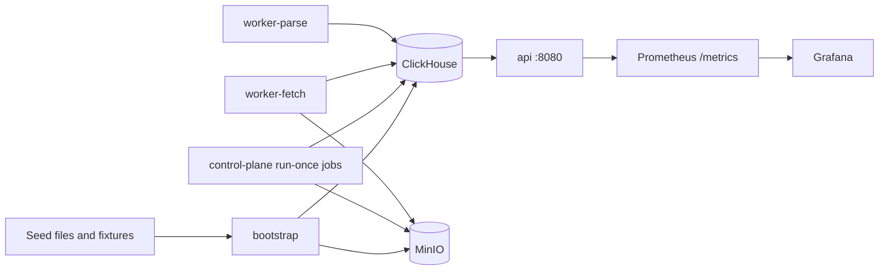

# OIDA Backend

Production-oriented Go OSINT backend for source governance, crawl/parse/promote jobs, ClickHouse-backed analytics, and a read-only REST API over `gold.api_v1_*` views.

The repository is now Go-only. The old Python medallion runtime, queue workers, metadata database, and orchestration stack have been removed from the production path.

## Architecture



## Services

- `api`: read-only HTTP API with scoped API-key auth, CORS, request IDs, rate limits, and Prometheus metrics.
- `bootstrap`: creates buckets, applies ClickHouse migrations, seeds source governance and hashed API clients, uploads bootstrap assets, and writes the ready marker.
- `control-plane`: deterministic `run-once` jobs for place materialization, promotion, source ingest orchestration, stored pipeline execution, backup, restore, and retention.
- `worker-fetch`: crawler/frontier fetch worker.
- `worker-parse`: parser worker for retained raw artifacts.
- `clickhouse` and `minio`: single-node storage target for local and production Compose.
- `prometheus`, `alertmanager`, `grafana`: local monitoring stack.

## Quick Start

```sh
cp .env.example .env
docker compose up -d --build
docker compose run --rm bootstrap verify
curl -fsS http://localhost:8080/v1/ready
```

Protected `/v1/*` routes require `X-API-Key`. API clients are seeded from `seed/api_clients.json` as SHA-256 hashes; do not store raw production keys in the repository. To create a replacement client:

```sh
printf '%s' 'oida_your_client_random_secret' | sha256sum
```

Use the hex digest as `key_sha256`, give the client the narrowest scopes it needs, and rerun bootstrap. Supported scopes are exact matches such as `read:*` and `read:internal`; `admin:*` satisfies all API scopes.

## Commands

```sh
make test              # Dockerized go test ./...
make build             # static Go build for every binary
make verify            # compose config, Go tests, builds, and generated API docs contracts
make verify-full       # includes compose startup, bootstrap verify, and e2e tests

docker compose run --rm control-plane run-once --job promote
docker compose run --rm control-plane run-once --job backup-clickhouse
docker compose run --rm control-plane run-once --job retention-materialize
```

Restore is intentionally explicit:

```sh
CLICKHOUSE_RESTORE_URL=http://minio:9000/backup/clickhouse/<backup-name> \
  docker compose run --rm control-plane run-once --job restore-clickhouse
```

## Verification

The default verification gate is:

```sh
./scripts/verify.sh
```

It runs `docker compose config`, Dockerized `go test ./...`, `CGO_ENABLED=0 go build ./...`, and the generated API contract checks. `FULL=1 ./scripts/verify.sh` starts the Compose stack, waits for readiness, runs `bootstrap verify`, and executes the e2e suite behind the `e2e` build tag.

## Operations

- API readiness: `GET /v1/ready`.
- Prometheus metrics: `GET /metrics` with `Authorization: Bearer $METRICS_SHARED_KEY`.
- Prometheus receives the same `METRICS_SHARED_KEY` through the Compose config interpolation used by the API service.
- Grafana is exposed on `http://localhost:3001` in the single-node Compose topology.
- ClickHouse HTTP is published on host port `8124` and container port `8123`.
- Backup and restore use native ClickHouse `BACKUP`/`RESTORE` to S3-compatible MinIO paths under the `backup` bucket.
- TTL cleanup is handled by table TTL definitions and can be forced with the `retention-materialize` run-once job.

## Documentation

- API reference: `docs/api-reference.md`
- Schema standards: `docs/schema-standards.md`
- Fresh bootstrap: `docs/runbooks/fresh-bootstrap.md`
- Backup and restore: `docs/runbooks/backup-restore.md`
- Kill switches: `docs/runbooks/kill-switch.md`
- Upgrade migrations: `docs/runbooks/upgrade-migration.md`

<!-- BEGIN GENERATED: api-route-inventory -->
## Frontend Go REST API contract

The read-only Go REST API keeps one authoritative route inventory shared by router registration, `/v1/schema`, contract fixtures, and generated docs.

Public routes: `/v1/health`, `/v1/ready`, `/v1/version`, `/v1/schema`. All other `/v1/*` routes require `X-API-Key` with the route's documented scopes.

Current route inventory:
- `GET /v1/health` — public
- `GET /v1/ready` — public
- `GET /v1/version` — public
- `GET /v1/schema` — public
- `GET /v1/jobs` — protected
- `GET /v1/jobs/{jobId}` — protected
- `GET /v1/sources` — protected
- `GET /v1/sources/{sourceId}` — protected
- `GET /v1/sources/{sourceId}/coverage` — protected
- `GET /v1/places` — protected
- `GET /v1/places/{placeId}` — protected
- `GET /v1/places/{placeId}/children` — protected
- `GET /v1/places/{placeId}/metrics` — protected
- `GET /v1/places/{placeId}/events` — protected
- `GET /v1/places/{placeId}/observations` — protected
- `GET /v1/entities` — protected
- `GET /v1/entities/{entityId}` — protected
- `GET /v1/entities/{entityId}/tracks` — protected
- `GET /v1/entities/{entityId}/events` — protected
- `GET /v1/entities/{entityId}/places` — protected
- `GET /v1/events` — protected
- `GET /v1/events/{eventId}` — protected
- `GET /v1/observations` — protected
- `GET /v1/observations/{recordId}` — protected
- `GET /v1/metrics` — protected
- `GET /v1/metrics/{metricId}` — protected
- `GET /v1/analytics/rollups` — protected
- `GET /v1/analytics/time-series` — protected
- `GET /v1/analytics/hotspots` — protected
- `GET /v1/analytics/cross-domain` — protected
- `GET /v1/search` — protected
- `GET /v1/search/places` — protected
- `GET /v1/search/entities` — protected
- `GET /v1/internal/stats` — protected
- `GET /v1/internal/worker-tail` — protected
<!-- END GENERATED: api-route-inventory -->
